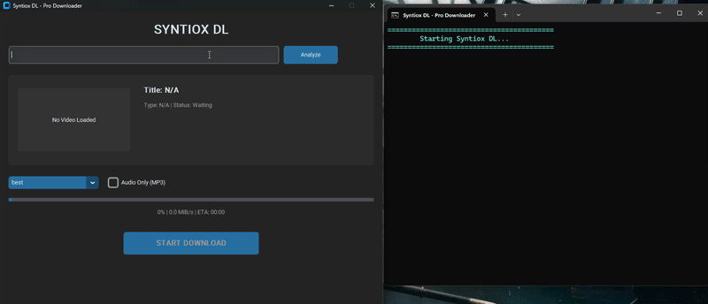

# 🚀 Syntiox DL - Pro Video Downloader


**Syntiox DL** is a highly advanced, professional, and visually appealing Video/Audio Downloader built with Python. It bypasses common bot-protections and ensures downloaded videos are universally playable across all devices.



## ✨ Key Features

* **Modern Dark Mode GUI**: Built with `CustomTkinter` for a seamless user experience.

* **Organized Downloads**:  Automatically saves media to your system's default folders (Music/yt syntiox for Audio and Videos/yt syntiox for Videos) so you never lose your files.

* **Smart Playability Filter**: Automatically filters and downloads `H.264 (AVC) + AAC (M4A)` formats, completely avoiding unplayable AV1/WebM formatting issues.

* **Anti-Bot Bypass**: Uses Android client spoofing and custom User-Agents to bypass `HTTP 403 / 429` and JavaScript runtime errors.

* **Intelligent Auto-Resume**: If your connection drops, it automatically retries and resumes from where it left off (up to 15 retries).

* **Playlist Support**: Automatically detects playlists and fetches metadata seamlessly.

* **Audio Extraction**: Easily download any video directly as a high-quality 192kbps MP3.

---

## ⚙️ Prerequisites

Before you begin, ensure you have met the following requirements:
1.  **Python 3.10** or higher installed.
2.  **FFmpeg** (CRITICAL for merging video and audio).

---

## 🛠️ Installation & Setup

**Step 1: Clone the Repository**
```bash
git clone https://github.com/sh4lu-z/Syntiox-DL.git
cd Syntiox-DL
```

**Step 2: Install Python Dependencies**

```bash
pip install -r requirements.txt
```

(Required packages: `yt-dlp`, `customtkinter`, `Pillow`, `requests`)

**Step 3: Setup FFmpeg (Crucial Step)**

The application requires FFmpeg to merge high-quality video and audio tracks. 
If you encounter the ERROR: ffmpeg is not installed message, follow this foolproof method:

1. Download the latest FFmpeg build from `https://github.com/BtbN/FFmpeg-Builds/releases`
2. Extract the `.zip` file.
3. Open the `bin` folder and copy the `ffmpeg.exe` file.
4. Paste `ffmpeg.exe` directly into the root folder of this project (in the same directory as main.py).

# 🚀 How to Run

There are two ways to run the application:

### Option 1: Using the Batch File (Recommended for Windows)

1. Simply double-click the run.bat file located in the root folder.

2. This will automatically open a command prompt window and start the application. If any errors occur, the window will stay open so you can read the error message.

### Option 2: Using the Terminal

1. Open your terminal or command prompt.
2. Navigate to the project directory.
3. Run the following command:

```bash
python main.py
```

1. Paste your Video or Playlist URL into the search bar.
2. Click Analyze to fetch thumbnails, duration, and available qualities.
3. Select your preferred resolution (or Audio Only).
4. Click START DOWNLOAD.

## 💡 Advanced Configuration (Instagram / Private FB Videos)

By default, the engine is optimized for public platforms like YouTube and TikTok. However,
if you want to download videos from Instagram, Private Facebook Groups, or X (Twitter),
you need to authenticate using your browser's cookies.

How to enable Cookie Support:

1. Open `core/engine.py` in your code editor.
2. Locate the `ydl_opts` dictionary inside the `download` method.
3. Add the following line to extract cookies from your default browser:
```bash
'cookiesfrombrowser': ('chrome',),
```
(Note: Change `'chrome'` to `'edge'`, `'firefox'`, or `'brave'` depending on what browser
you use to log into Instagram/Facebook).

### 🐛 Troubleshooting

Issue: HTTP Error 403: Forbidden

      Fix: Your yt-dlp version might be outdated. Run pip install --upgrade yt-dlp to fetch the latest patches.

Issue: Video downloads but shows "Cannot Play Video" (Audio only plays or corrupted)

      Fix: This happens if FFmpeg merges AV1 video with Opus audio. Syntiox DL uses a Smart Filter 
      to prevent this. Ensure your core/engine.py is up-to-date with the repository.

Issue: Terminal gets too messy with logs

     Fix: The application uses an os.system('cls') command to keep the terminal clean. Ensure
     you are running it in a standard command prompt or PowerShell.


👨‍💻 Developed By
Syntiox / sh4lu-z

GitHub: [ Sh4lu-Z](https://github.com)

Feel free to fork this repository, submit pull requests, or open issues if you find any bugs!     


