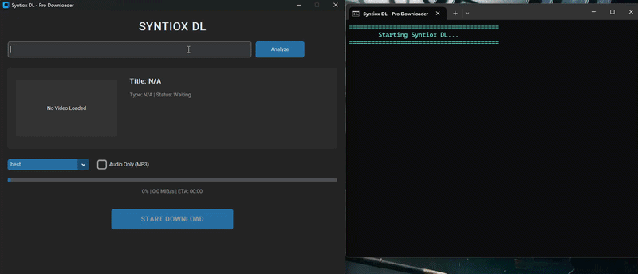

# 🚀 Syntiox DL - Pro Video Downloader


**Syntiox DL** is a highly advanced, professional, and visually appealing Video/Audio Downloader built with Python. It bypasses common bot-protections and ensures downloaded videos are universally playable across all devices.



### 📥 Supported Sites
yt-dlp supports over **1,000+ websites**, including YouTube, TikTok, Facebook, Instagram, and many more.

Check out the full list of supported sites here:
👉 [](https://github.com/yt-dlp/yt-dlp/blob/master/supportedsites.md)

## ✨ Key Features

* **Modern Dark Mode GUI**: Built with `CustomTkinter` for a seamless user experience.
* **One-Click Installer**: Professional Setup Wizard with Start Menu and Desktop shortcuts.
* **Auto FFmpeg Install**: Automatically installs FFmpeg via Winget if not found on your system.
* **Auto yt-dlp Update**: If a 403 error occurs, the app auto-updates its core to the latest version.
* **Organized Downloads**: Saves to Music/Syntiox DL (Audio) or Videos/Syntiox DL (Video) by default.
* **Custom Download Folder**: Choose any folder you want via the Browse button.
* **Smart Playability Filter**: Downloads `H.264 (AVC) + AAC (M4A)` formats, avoiding unplayable AV1/WebM issues.
* **Anti-Bot Bypass**: Uses Android client spoofing and custom User-Agents to bypass `HTTP 403 / 429` errors.
* **Intelligent Auto-Resume**: Retries and resumes from where it left off (up to 15 retries).
* **Playlist Support**: Automatically detects playlists and fetches metadata seamlessly.
* **Audio Extraction**: Download as MP3 with quality selection (320kbps, 256kbps, 192kbps, 128kbps).
* **MP3 Cover Art**: Automatically embeds the video thumbnail as album art in MP3 files.
* **Cancel Button**: Stop any download mid-way with the Cancel button.

---

## 📦 Quick Start (Recommended)

1. Go to the [**Releases Page**](https://github.com/sh4lu-z/Syntiox-DL/releases/latest)
2. Download `Syntiox DL.exe`
3. Run the installer and follow the setup wizard
4. Launch the app from your Desktop or Start Menu!

### ⚠️ Windows SmartScreen Warning

When you run the `.exe` for the first time, Windows may show a **"Windows protected your PC"** warning. This is normal for unsigned apps and does **NOT** mean the app is harmful.

**To bypass it:**
1. Click **"More info"** on the warning dialog
2. Click **"Run anyway"**

> This happens because the app is not commercially code-signed. The source code is fully open — feel free to review it!

---

## 🛠️ Developer Setup (Optional)

If you want to run from source code instead:

**Step 1: Clone the Repository**
```bash
git clone https://github.com/sh4lu-z/Syntiox-DL.git
cd Syntiox-DL
```

**Step 2: Install Python Dependencies**

```bash
pip install -r requirements.txt
```

**Step 3: Run**
```bash
python main.py
```

> **Note:** FFmpeg will be auto-installed via Winget on first use if not already present.

---

## 💡 Advanced Configuration (Instagram / Private FB Videos)

By default, the engine is optimized for public platforms like YouTube and TikTok. However,
if you want to download videos from Instagram, Private Facebook Groups, or X (Twitter),
you need to authenticate using your browser's cookies.

How to enable Cookie Support:

1. Open `core/engine.py` in your code editor.
2. Locate the `ydl_opts` dictionary inside the `download` method.
3. Add the following line to extract cookies from your default browser:
```bash
'cookiesfrombrowser': ('chrome',),
```
(Note: Change `'chrome'` to `'edge'`, `'firefox'`, or `'brave'` depending on what browser
you use to log into Instagram/Facebook).

### 🐛 Troubleshooting

| Issue | Fix |
|---|---|
| **HTTP Error 403: Forbidden** | The app auto-updates yt-dlp when this happens. If it persists, try again after a few minutes. |
| **Video won't play (corrupted)** | Ensure FFmpeg is installed. The app uses a Smart Filter to prevent AV1/WebM issues. |
| **SmartScreen blocks the app** | Click "More info" → "Run anyway". See instructions above. |
| **FFmpeg not found** | The app auto-installs via Winget. If Winget is unavailable, install manually from [ffmpeg.org](https://ffmpeg.org/download.html). |

---

👨‍💻 **Developed By**: Syntiox / sh4lu-z

<a href="https://github.com/Sh4lu-Z">
  
</a>

Feel free to fork this repository, submit pull requests, or open issues if you find any bugs!
